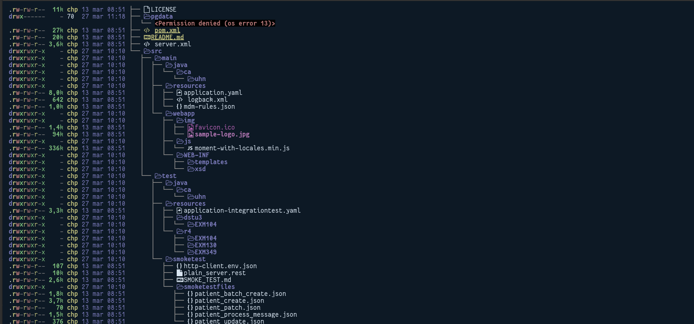
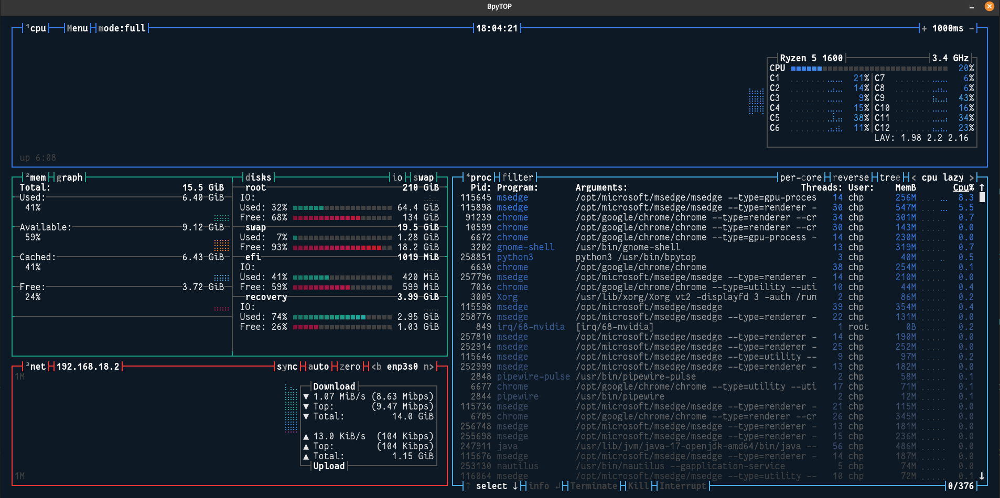

# Welcome to my personal terminal


Installation/Configuration (POP ubuntu)

* <p> Terminal </p>

Install Kitty terminal
```shell
curl -L https://sw.kovidgoyal.net/kitty/installer.sh | sh /dev/stdin
```
Clone my repository
```shell
git clone https://github.com/Chp-Dev/TerminalConfig
```
Configuration Kitty
```shell
cp -r TerminalConfig/config/ ~/.config/
```

* <p> Plugins </p>


# exa



Install exa
```bash
sudo apt install exa
```
Examples of how to test exa

https://tldr.inbrowser.app/pages/common/exa


# 



Install Bpytop
```bash
sudo apt install bpytop
```

